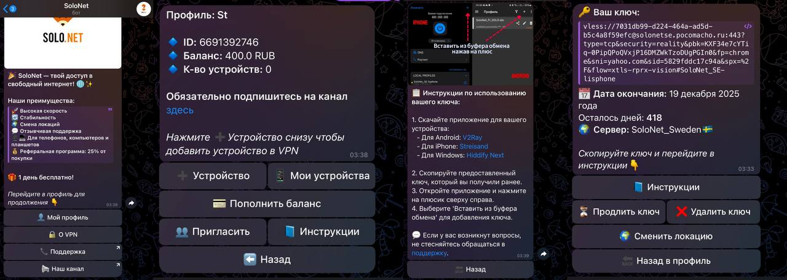
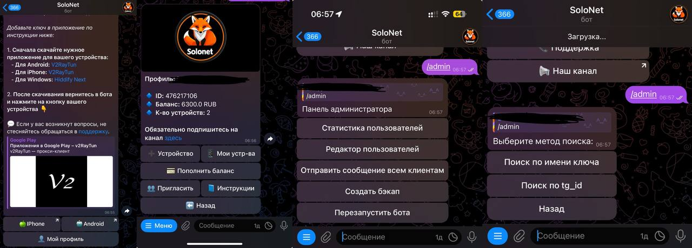

# 🚀 SoloBot

**SoloBot** — ваш идеальный помощник для управления API 3x-UI VPN на протоколе VLESS.

Три версии — море возможностей:

- [v1.4](https://github.com/Vladless/Solo_bot/releases/tag/v1.4) — бот для продажи ключей VLESS:



- [v2.3.1](https://github.com/Vladless/Solo_bot/releases/tag/v2.3.1) — стабильная версия подписок вместо ключей с
  кнопками автодобавления в приложение:



- [v3.1](https://github.com/Vladless/Solo_bot/releases/tag/v3.1) — версия бота со значительным расширением возможностей.

[Последние актуальные релизы.](https://github.com/Vladless/Solo_bot/releases)
Если вам не хватает функций — направьте их в [issue](https://github.com/Vladless/Solo_bot/issues), мы реализуем.

## 📋 Оглавление

1. [Описание](#-описание)
2. [Стек технологий](#-стек-технологий)
3. [Установка](#-установка)
4. [Конфигурация](#-конфигурация)
5. [Запуск](#-запуск)
6. [Контакты](#-solobot-в-telegram-и-полная-версия)

---

## 📖 Описание

SoloBot реализует множество функций, включая:

- **Выдача подписок на различные периоды** (1 месяц, 3 месяца, полгода, год).
- **Использование тестового периода подписки.**
- **Продление ключей** на указанные периоды.
- **Полный контроль** клиента над своими ключами:
    - **Просмотр** информации о ключе (сервер, оставшееся время, сам ключ).
    - **Продление** ключей.
    - **Удаление** ключей.
- **Смена локации** (перемещение ключа между серверами).
- **Поддержка нескольких ключей и устройств** для одного клиента.
- **Реферальная программа** с уникальной ссылкой для приглашений.
- Доступ к **инструкциям** для подключения к сервису.
- Пополнение баланса:
    * **Юкасса** (Самозанятость и ИП)
    * **Юмани** (Физические Лица) ([TrackLine](https://github.com/TrackLine))
    * **FreeKassa** (Физические Лица)
    * **Robokassa** (Физические Лица)
    * **Cryptobot** (Криптовалюта) ([izzzzzi](https://github.com/izzzzzi))
    * **Звезды Telegram**
- Периодические **бэкапы базы данных клиентов**.
- Уведомления:
    - Произвольные сообщения через панель администратора.
    - Уведомления о неиспользованных пробниках.
    - Уведомления об истекающих ключах (за сутки, за 6 часов и в момент истечения).
- **Чат поддержки** и канал для связи.
- **Автоматическое продление ключа** при наличии достаточного баланса.
- **Удобная панель администратора прямо в боте**
- Серверы:
    - **Мультисерверность** — добавление сервера прямо в админке
    - **Проверка на доступность** — бот следит за серверами и их откликом
    - **Балансировка** — бот выдает подписку на наименее загруженный сервер

---

## 💻 Стек технологий

Основные технологии, используемые в проекте:

- **Python** версии 3.10 (3.12, для последних версий).
- **PostgreSQL** — для хранения данных.
- **aiogram** — для взаимодействия с Telegram API.
- **aiohttp** — для API запросов к панелям.

Проект полностью асинхронный, что обеспечивает высокую скорость работы.

---

## ⚙️ Установка

### 1️⃣ Шаг 1: Клонирование репозитория

Клонируйте репозиторий и перейдите в его директорию:

```bash
git clone https://github.com/Vladless/Solo_bot.git
cd solo_bot
```

### 2️⃣ Шаг 2: Создание и подключение виртуального окружения

Создайте виртуальное окружение **Python** и перейдите в сессию:

```
python3 -m venv venv
source venv/bin/activate
```

### 3️⃣ Шаг 3: Установка зависимостей

Установите зависимости:

```
pip install -r requirements.txt
```

### 🛠️ Конфигурация

Для правильной работы вам нужно:

* Установить и запустить **PostgreSQL**, создать пользователя для работы с базой данных и выдать ему права
* Настроить ваш сервер для работы с ботом, выпустить SSL сертификат для домена
* Настроить вебхуки и указать пути до них через любой веб-сервер, например **nginx**

* Создать файл config.py в корневой папке проекта с вашими данными:

```
API_TOKEN = "токен вашего бота телеграм"

ADMIN_USERNAME = "логин от вашей панели x-ray"
ADMIN_PASSWORD = "пароль от вашей панели x-ray"
ADD_CLIENT_URL = f"{API_URL}/panel/api/inbounds/addClient"
GET_INBOUNDS_URL = f"{API_URL}/panel/api/inbounds/list/"
AUTH_URL = f"{API_URL}/login/"
```

**Мы высылаем детальный гайд и недостающие файлы в поддержке бота!**

### 🚀 Запуск

Введите команду из виртуального окружения `venv/bin/activate`

```
python3 main.py
```

### 🔗 SoloBot в Telegram и Полная версия

#### Наш [**➡ сайт**](https://pocomacho.ru/solonetbot/):

Всегда актуальные гайды по установке, файлы для запуска и ссылка на общий чат:


Попробовать SoloBot прямо сейчас в Telegram [**➡ Попробовать**](https://t.me/SoloNetVPN_bot).

#### Отзывы пользователей:
SoloBot уже помог сотням пользователей!:


 **Читать** [**➡ Отзывы**](https://pocomacho.ru/solonetbot/reviews/)

Связаться с нами через [**➡ поддержку**](https://t.me/solonet_sup). Там вы сможете купить полную версию и получить логин
и пароль от сайта, получить доступ в наш чат сообщества, а также задать необходимые вопросы!

## Права на использование

[Этот проект использует лицензию CC BY-NC 4.0](LICENSE)
