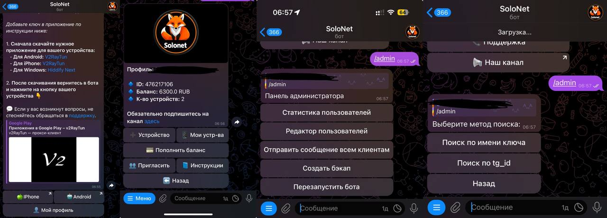

# 🚀 SoloBot

**SoloBot** — ваш идеальный помощник для управления API 3x-UI VPN на протоколе VLESS.  

Три версии — море возможностей:
  - v1.4 — бот для продажи ключей vless:


  - v2.3.1 — стабильная версия подписок вместо ключей с кнопками автодобавления в приложение:


  - v3.1 — настолько большая, что смотрите в [релизе](https://github.com/Vladless/Solo_bot/releases/tag/v3.1):


Если вам не хватает функций — направьте их в issue, мы реализуем

## 📋 Оглавление
1. [Описание](#описание)
2. [Стек технологий](#стек-технологий)
3. [Установка](#установка)
4. [Конфигурация](#конфигурация)
5. [Запуск](#запуск)
6. [Контакты](#контакты)

---

## 📖 Описание

SoloBot реализует множество функций, включая:

- **Выдача подписок на пробный и длительные периоды** (1 месяц, 3 месяца, полгода, год).
- **Продление ключей** на указанные периоды.
- Полный контроль клиента над своими ключами:
  - Удаление ключей.
  - Продление ключей.
  - Просмотр информации о ключе (сервер, оставшееся время, сам ключ).
- **Смена локации** (перемещение ключа между серверами).
- Поддержка нескольких ключей для одного клиента (несколько устройств).
- **Реферальная программа** с пригласительной ссылкой.
- Доступ к **инструкциям**.
- **Пополнение баланса**:
    * через Юкасса (самозанятость и ИП)
    * через freekassa (Физические Лица)
    * Криптовалюта (Thanks [izzzzzi](https://github.com/izzzzzi))
    * Звезды Telegram
    * Юмани (физические лица) (Thanks [TrackLine](https://github.com/TrackLine))
- Периодические **бэкапы базы данных клиентов**.
- Уведомления:
  - Произвольные сообщения через админку.
  - Уведомления о неиспользованных пробниках.
  - Уведомления о истекающих ключах (за сутки, за 6 часов и в момент истечения).
- **Чат поддержки** и канал для связи.
- **Автоматическое продление ключа** при наличии достаточного баланса.
- **Удобная админка прямо в боте**
- Серверы:
  - **мультисерверность**- добавление сервера прямо в админке
  - **Проверка на доступность** - бот следит за серверами и их откликом
  - **Балансировка** - бот выдает подписку на наименее загруженный сервер


---

## 💻 Стек технологий

Проект использует следующие технологии:

- **Python** версии 3.10 или выше.
- **Git** для клонирования репозитория.
- **Virtualenv** для создания виртуального окружения (рекомендуется).
- **PostgreSQL** для хранения данных.
- **Nginx** для работы с вебхуками.
- **aiogram** (версия 3.13) для взаимодействия с Telegram API.
- **youkassa** для обработки платежей.
- **aiohttp** для API запросов к панелям.

Проект полностью асинхронный, что обеспечивает высокую скорость работы.

---

## ⚙️ Установка

### 1️⃣ Шаг 1: Клонирование репозитория

Клонируйте репозиторий и перейдите в его директорию:

```bash
git clone https://github.com/Vladless/Solo_bot.git
cd solo_bot
```

### 2️⃣ Шаг 2: Создание и активация виртуального окружения

```
python3 -m venv venv
source venv/bin/activate
```

### 3️⃣ Шаг 3: Установка зависимостей

```
pip install -r requirements.txt
```

### 🛠️ Конфигурация

Для правильной работы вам нужно:

* установить и запустить postgresql, создать пользователя для работы с базой данных и выдать ему права
* Настроить ваш сервер на работу с ботом, выпустить SSL сертификат для домена
* Настроить вебхуки и пути до них в NGINX

* Создать файл config.py в корневой папке проекта с вашими данными:

```

API_TOKEN = токен вашего бота телеграм

ADMIN_USERNAME = логин от вашей панели x-ray
ADMIN_PASSWORD = пароль от вашей панели x-ray
ADD_CLIENT_URL = f"{API_URL}/panel/api/inbounds/addClient"
GET_INBOUNDS_URL = f"{API_URL}/panel/api/inbounds/list/"
AUTH_URL = f"{API_URL}/login/"

```
**Мы высылаем детальный гайд и недостающие файлы в поддержке бота**


### 🚀 Запуск

введите команду из виртуального окружения

```
python main.py
```
### 🔗 SoloBot в Telegram и Полная версия

#### Наш [**➡ сайт**](https://pocomacho.ru/solonetbot/):

Всегда актуальные гайды по установке, файлы для запуска и ссылка на общий чат:


Попробовать SoloBot прямо сейчас в Telegram [**➡ Попробовать**](https://t.me/SoloNetVPN_bot).

Связаться с нами через [**➡ поддержку**](https://t.me/solonet_sup). Там вы сможете купить полную версию и получить логин и пароль от сайта, а также задать необходимые вопросы!
