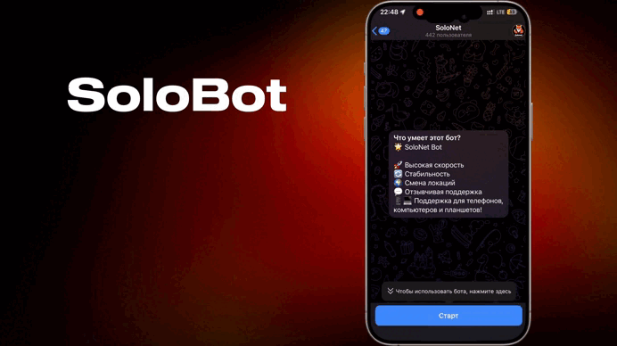

# 🚀 SoloBot

**SoloBot** — ваш идеальный помощник для управления API 3x-UI VPN на протоколе VLESS.

# Описание
Бот, предоставляющий инструменты под различные реализации. Хорошая кастомизация и подстройка под свой бренд.

# Основные возможности

**SoloBot** реализует множество функций, включая:

### Управление подписками
- Выдача подписок на различные периоды (**1 месяц, 3 месяца, полгода, год**).
- Использование **тестового периода** подписки.
- Продление ключей на указанные периоды.

### Полный контроль клиента над своими ключами
- Просмотр информации о ключе (**сервер, оставшееся время, сам ключ**).
- Продление ключей.
- Удаление ключей.
- Просмотр полной информации вплоть до минут истечения
- Смена локации (**перемещение ключа между серверами**).
- Поддержка **нескольких ключей и устройств** для одного клиента.

### Реферальная программа
- Уникальная ссылка для приглашений.
- Инлайн режим или обычные сообщения

### Интеграция платёжных систем
В боте реализована интеграция касс как для физических лиц, так и для самозанятых и ИП:
- **Юкасса** (Самозанятость и ИП)
- **Юмани** (Физические Лица) (TrackLine)
- **Robokassa** (Физические Лица)
- **Cryptobot** (Криптовалюта) (izzzzzi)
- **Звезды Telegram**

### Безопасность и стабильность
- **Периодические бэкапы** базы данных клиентов и их восстановление.
- **Смена домена** в случае переезда.

### Уведомления
- **Произвольные сообщения** через панель администратора.
- Уведомления о **неиспользованных пробниках**.
- Уведомления об **истекающих ключах** (_за сутки, за 6 часов и в момент истечения_).
- **Воронка продаж**. Если клиент не взял пробник предлагаются более выгодные условия.
- **Рассылка лично или всем.** С сохранением форматирования и отправкой картинок

### Серверы
- **Мультисерверность** — добавление сервера прямо в админке.
- **Проверка на доступность** — бот следит за серверами и их откликом.
- **Балансировка** — бот выдает подписку на наименее загруженный сервер.
- **Сихронизация** — перемещайте клиентов на другие сервера бесшовно.

### Удобная админ-панель
- **Поиск клиента** — по айди, нику или ключу.
- **Управление подпиской клиента** — перевыпуск, изменение баланса и остальное.
- **Управление ботом** — перезагрузка, списки банов, смена домена.
- *А также рассылки, создание купонов, просмотр детальной статистики и многое другое*

### Кастомизация
- **Пробник** — Сами решаете будет или нет. Количество дней пробника также кастомизируется.
- **Реферальная программа** — процент с каждого пополнения или фиксированная сумма.
- **Все меню** — меняйте все меню как вам захочется, описания и тексты.
- **Кешбэк** — начисляйте кэшбек за пополнения, если хотите.
- **Настройки** — капча, подписка на канал, купоны и прочее.
- **Автоматика** — удалять ли ключи после продления, продлевать ли их и остальное.

### *Настраивайте как вам удобно!*

## Список версий

#### Бот постоянно развивается, обрастая новыми возможностями.
#### Для полного рассмотрения каждой версии ознакомьтесь с [**релизами**](https://github.com/Vladless/Solo_bot/releases).

## 🔗 SoloBot в Telegram и Полная версия

#### Наш [**➡ сайт**](https://pocomacho.ru/solonetbot/):

Всегда актуальные гайды по установке, файлы для запуска и ссылка на общий чат:

Попробовать SoloBot прямо сейчас в Telegram [**➡ Попробовать**](https://t.me/SoloNetVPN_bot).

#### Отзывы пользователей:
SoloBot уже помог сотням пользователей в нашем сообществе:

 **Читать** [**➡ Отзывы**](https://pocomacho.ru/solonetbot/reviews/)

Связаться с нами через [**➡ поддержку**](https://t.me/solonet_sup). Там вы сможете купить полную версию и получить логин
и пароль от сайта, получить доступ в наш чат сообщества, а также задать необходимые вопросы!

## Права на использование

#### Перепродажа кода запрещена, ознакомьтесь с лицензией

[Этот проект использует лицензию CC BY-NC 4.0](LICENSE)
